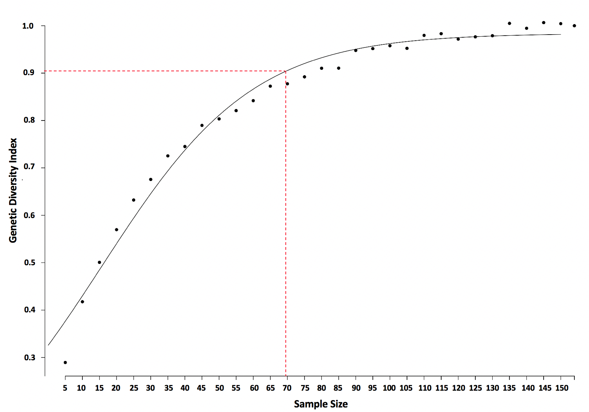

# Wild-Oil-Palm-Genetic-Diversity-and-Conservation-Program

### Genomic variants
The oil palm genome consists of 1.8 billion copies of four base molecules (A,T,G,C) arranged in pairs along the DNA. These sequences of "base pairs" define genomic sequences that code for genes responsible for the expression of specific traits/characteristics (e.g., height, number of fruits produced, disease resistance, fruit size etc.). Despite the massive size of the genome, there is remarkably little variation among oil palm samples. Instead of working with the full length of genomic sequences, we take advantage of the small variation among palms and only store the difference between genomes. These differences are considered genomic variants that arise from either a single mutations (e.g., single nucleotide polymorphisms, SNPs) or insertions/deletions (e.g., indels) along the genomic sequence.

### Principle Components Analysis
This example of PCA looks for clusters of oil palm samples that share a high degree of genetic similarities by projecting the high-dimensional genome-wide variant data into two dimensions that explain the variation (PC1 and PC2, accounting for 76% of genetic variation). The PCA reveals clusters of oil palm samples corresponding to African and Latin American species of oil palm as well as geographic origin of 653 oil palm samples across 70,100 genomic variants.

### Genetic diversity between African and Latin American Oil palm populations
Population genetic diversity estimates indicate that African oil palm species (green) is genetically more diverse than Latin American species (orange). The F statistic describes the amount of genetic diversity

### Simulation Method: Simple random sampling to identify minimal sample size to capture 90% of genetic variation
This 

### Bayesian Method to Identifying Patterns of Natural Selection
