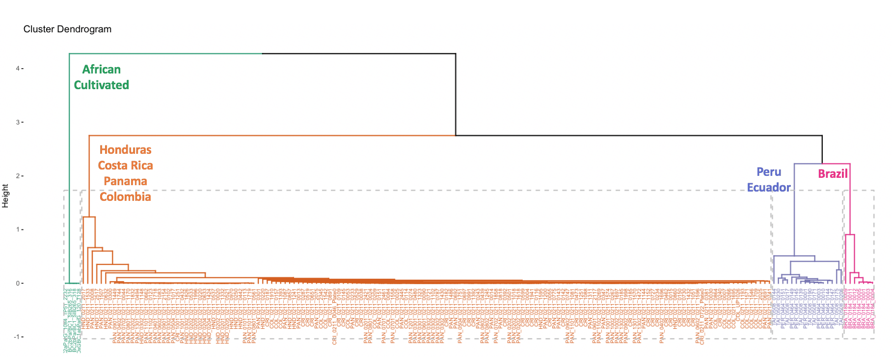
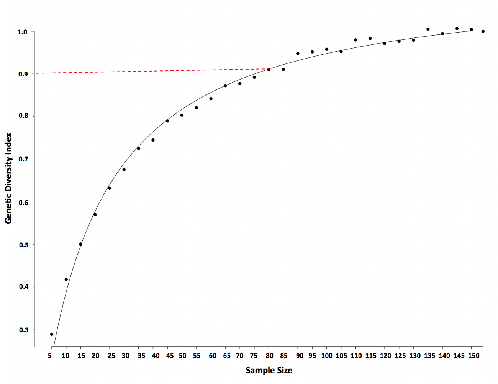

# Wild-Oil-Palm-Genetic-Diversity-and-Conservation-Program

The purpose of this study is to conduct an exploratory analysis on high dimensional genomic sequence data to understand the genetic diversity, geographic groupings and relatedness of wild oil palm important for conservation programs aimed at future improvement of current cultivated varieties. 

### Genomic variants
The oil palm genome consists of 1.8 billion copies of four base molecules (A,T,G,C) arranged in pairs along the DNA. These sequences of "base pairs" define genomic sequences that code for genes responsible for the expression of specific traits/characteristics (e.g., height, number of fruits produced, disease resistance, fruit size etc.). Despite the massive size of the genome, there is remarkably little variation among oil palm samples. Instead of working with the full length of genomic sequences, we take advantage of the small variation among palms and only store the difference between the genomes of each palm. These differences are considered genomic variants that arise from either a single mutations (e.g., single nucleotide polymorphisms, SNPs) or insertions/deletions (e.g., indels) along the genomic sequence.

### Principle Components Analysis
This PCA looks for clusters of oil palm samples that share a high degree of genetic similarities by projecting the high-dimensional genome-wide variant data into two dimensions that explain the the most variation (PC1 and PC2, accounting for 76% of genetic variation). The PCA reveals clusters of oil palm samples corresponding to African and Latin American species of oil palm as well as geographic origin of 653 oil palm samples across 70,100 genomic variants. 

**Scripts**:
[PCA.R](Principle_Components_Analysis/PCA.R) & [PCA_transformData.py](Principle_Components_Analysis/PCA_transformData.py)

### Hierarchical clustering analysis & K-means clustering: 
Hierarchical clustering was implemented to undersand the genetic grouping and how they relate to one other. 

**Script**: [HierarchicalClustering_KmeansClustering.R]("Hierarchical_Clustering.R")

  - **Agglomerative Hierarchical Clustering Analysis** established four distinct clusters/genetic groupings: i. African cultivated palms (green), ii. Hondura, Costa Rica, Panama, Colombia (HCPC, orange), iii. Brazil (purple), iv. Peru, Ecuador (PE, pink). As expected, these clusters reflect the geograpical distribution of the wild palms and the African cultivated species group is more genetic distinct than the Latin American species groups. Further, the clustering analysis indicates that palms form HCPC are highly related and there is very little genetic differences across the four countries potentially due to either high gene flow. We can, therefore, treat HCPC palms as one population for downstream analyses. The same is true for palms from Peru and Ecuador.
  

  - **K Means Clustering Analysis** with K = 4 clusters incorrectly classified the genetic groupings. It grouped one palm from Ecuador and some of the HCPC palms with the Brazilian palms. 
  

### Simulation Method: Simple random sampling to identify minimal sample size to capture 90% of total genetic variation
Conservation of wild genetic material is important to ensure long-term availability for future exploitation but maintaining genetic resources of wild oil palm samples are costly and requires large land resources. Simulations were carried out to define an optimal sample size to reduce genetic redundancy while maximizing genetic diversity of wild oil palm conservation collections. 

**Scripts**: [simulation.py](Simulations/simulation.py) & [Fitting_regression_curve.R](Simulations/Fitting_regression_curve.R)
  
  - Population genetic diversity estimates indicate that African oil palm species (green) is genetically more diverse than Latin American species (orange). Latin American palms are highly inbred, which translates to a high degree of genetic redundancy. Consequently, it is unneccessary to maintain the full collection of Latin American palms (N=150).

    

  - **METHOD** A simulation was used to determine the minimal sample size to capture at least 90% of total genetic variation observed in 150 wild American oil palm samples. A simulation was employed to randomly draw N individuals across different sample sizes (N=5 to 150 palms in increments of 5) from the entire American oil palms. For each sample size, the average fraction of genomic variant sites (number of genomic variant sites/total number of sites) across 100 simulations was calculated as a measure of genetic diversity captured (using a custom python script: simulation.py). A genetic diversity index was calculated by taking the ratio of diversity of each sample size and the total genetic diversity in the full set of 150 palms (mean fraction of genomic variant sites of sample size N / total fraction of genomic variant sites of total sample size N=150). 
  
  - **RESULTS**: Sampling 80 palms (out of 154) will likely capture at least 90% of total genetic diversity observed in the wild Latin American population. The nonlinear regression formula estimated here is y = 1.128 + x/(19.04 + x).

    

### Bayesian Method to Identifying Patterns of Natural Selection

