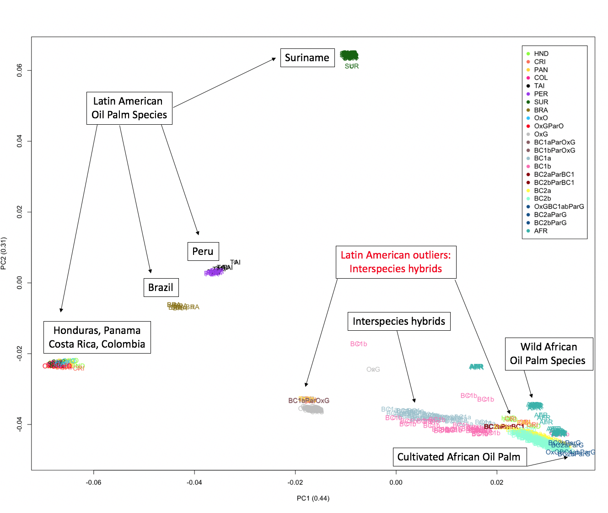

# Oil-Palm-Genetic-Diversity-and-Conservation-Program

### Genomic variants
The oil palm genome consists of 1.8 billion copies of four base molecules (A,T,G,C) arranged in pairs along the DNA. These sequences of "base pairs" define genomic sequences that code for genes responsible for the expression of specific traits/characteristics (e.g., palm height, number of fruits produces, disease resistance, fruit size etc.). Despite the massive size of the genome, there is remarkably few variation among oil palm samples. Instead of working with the full length of genomic sequences, we take advantage of the small varaition among palms and only store the difference between genomes. These differences are considered genomic variants that arise from a single mutations (e.g., single nucleotide polymorphisms, SNPs) or insertions/deletions (e.g., indels) along the genomic sequence.

### Principle Components Analysis
This example of PCA looks for clusters of oil palm samples that share a high degree of genetic similarities by projecting the high-dimensional genome-wide variant data into two dimensions (PC1 and PC2; explaining 76% of genetic variation). The PCA reveals clusters of oil palm samples corresponding to two different species of oil palm as well as geographic origin of 653 oil palm samples across 70,100 genomic variants.

